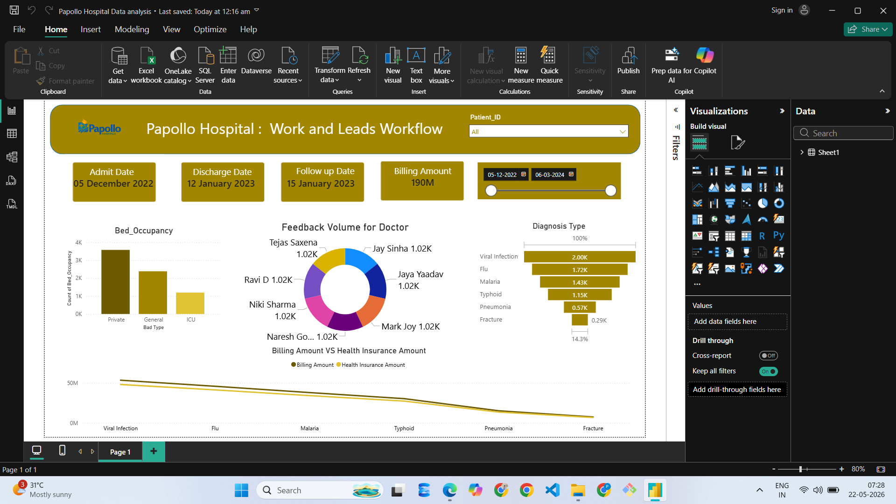

# Papollo Hospital Data Analysis Dashboard

## Overview
This Power BI dashboard analyzes hospital operations and patient workflow.

## Features
- Bed Occupancy Analysis
- Doctor Feedback Analysis
- Diagnosis Type Distribution
- Billing Amount Tracking
- Health Insurance Comparison

## Tools Used
- Power BI Desktop
- Excel
- DAX
- Power Query

## Dashboard Preview

## Author
Santanu Pramanik
